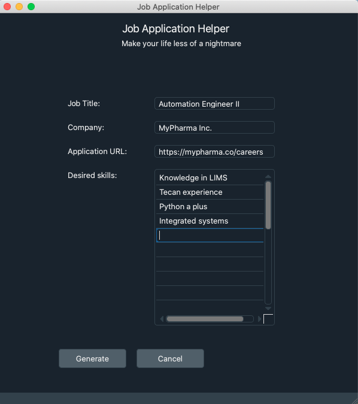

# job-app-helper
Simple tools to help personalize your job applications.

Likely to be discontinued due to self-realization that quality of application outweighs quantity. However, if you would like to create organized folders containing your resume (with the file name reflecting the company and position) along with a supplementary text file listing notable job requirements, then this might be useful.
<br>
<br>




Simply clone the repository, install requirements via ```pip install -r requirements.txt```, and run ```python main.py```
